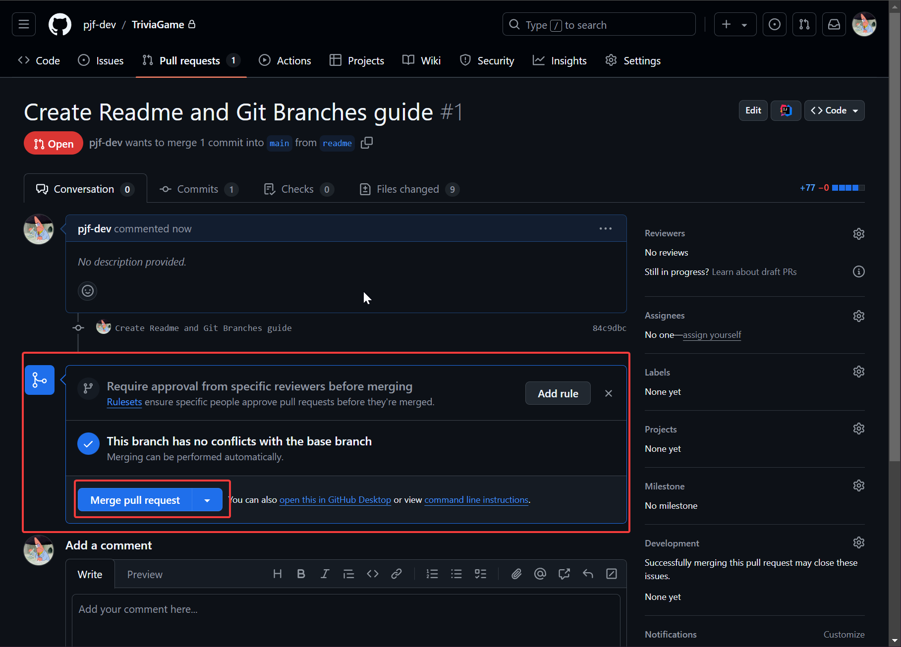

# Git Branches Guide
## Reason
Working with branches in a git repository allows us to individually work on 
tasks and features without worrying about commiting / pushing conflicting changes to the same branch

---
## What's a Branch
You can think of a branch as if it were the branch of a tree where each branch is a copy of the projects code. 
You take code that exists at the root (main branch), and split off into a new branch where changes don't
affect anything in the main branch or other branches that exist. Once you're ready to push your
changes to the main branch, you create a pull request.

---
## Pull Requests
When a specific branch is seen as complete, then you can create what's a called a pull request
which is essentially a request to merge your branch with another branch (usually main).  

When merging a pull request into a branch, the code should be reviewed to ensure it meets 
the standards of the main branch. Once that's done, it is analyzed for conflicting code / changes
which must be resolved before continuing with the merge. If there are no conflicts, then the code 
in the branch from the pull request becomes a part of the main branch, and the branch is usually deleted from there.

---
## Resolving Conflicts
As mentioned before, conflicts sometimes occur between two branches since the code in one branch
isn't always up to date with the branch it was created from. When this occurs, someone (usually the person who
opened the pull request) must go through all the conflicting files and changes to come up with
a single version that will exist after the merge. This usually involves refactoring the code
depending on what was changed and ensuring everything is working as it should before marking
everything as resolved

---
## How to Branch
There's multiple ways to create a branch, but it mostly depends on how you're interacting with
the repository. In this guide, I'll cover two ways: the first using the git command line, and the
second using the Git GUI tools inside Jetbrains IDE's (which Android Studio is based off).

1. ### Checkout the repository
    #### Command Line
         git clone [url]
    #### GUI
   Press "Get from VCS" and enter the repository URL or link your GitHub account and use that tab
    
2. ### Create or Checkout a Branch
   #### Command Line
       git branch [name] # Create a branch
       git checkout [name] # Checkout a branch
   #### GUI
   Either Git (From top bar menu) > New Branch...  
   Or Git Dropdown > New Branch... (See Image)
   
   
3. ### Make your changes and commit them
   #### Command Line
        git add [file] # To stage new files
        git commit -m [message] # To commit staged changes
   ### GUI
   Either press Git > Commit or the Git dropdown > Commit
   Which will open the commit window where you can stage changes / new files and add your message
   
4. ### Create a pull request
   On GitHub, navigate to the Pull Requests tab of the repository  
   Then click on new pull request to select which branches to involve in the pull request
   After selecting which branches to merge, you'll give your Pull Request a title and description
   
   
   
   
5. ### Resolve Conflicts & Merge
   The last step is to resolve any conflicts the two branches may have, and once ready,
   you can merge the branches to close the pull request. Optionally, you can delete the branch
   you merged from if it's no longer needed
   
   

## Additional Supporting Material
- [Git Cheat Sheet](https://education.github.com/git-cheat-sheet-education.pdf)  
- [Git Tutorial](https://git-scm.com/docs/gittutorial)  
- [Git Branching: Branches in a Nutshell](https://git-scm.com/book/en/v2/Git-Branching-Branches-in-a-Nutshell)  
- [GitHub: Creating a Pull Request](https://docs.github.com/en/pull-requests/collaborating-with-pull-requests/proposing-changes-to-your-work-with-pull-requests/creating-a-pull-request)  
